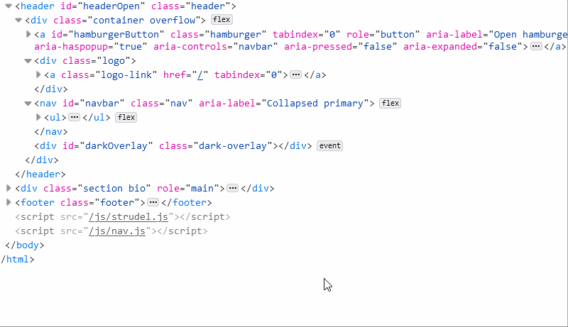

# strudel.js

A simple way to handle HTML attributes that change in reaction to keyboard interaction! :heart:

Having complex interactive elements on a web page often requires conditional updating of attribute values like `tabindex`, `aria-hidden`, or even `aria-label`. strudel.js automates the dynamic attribute values, so you don't have to manually change them on every user interaction!



## Quick example

```javascript

let isMenuOpen = function() {
  return strudel.hasClass('.menu', 'opened');
}

strudel.query(isMenuOpen)
    .watch('.menu', 'class')
    .reaction('.burger')
      .set('tabIndex', 0)
        .else()
      .set('tabIndex', -1);

```
This code block will automatically change all DOM elements with class 'burger' to be focusable when the `.menu` element has the class `opened`. The call to `.else()` tells strudel to apply the opposite condition (i.e. change burger elements to be unfocusable) in the case of the condition *not* being met.


## Model

strudel's syntax is based off of the syntax of a typical CSS media query: 

```css
@media screen and (max-width: 48em) {
  .burger {
    display: block;
  }
}
```
That is, you define:
1. a part of the web page to monitor for change

   e.g. `.watch('.menu', 'class')` in strudel, `screen` in css


2. a specific condition to satisfy

   e.g. the function `isMenuOpened` passed into the `query()` call in strudel,  `max-width: 48em` in css


3. and a functionality which is applied only if the condition is satisfied.

   e.g. `.burger {...}` styling in css, and in strudel:
   
   ```javascript

    .reaction('.burger')
      .set('tabIndex', 0)
        .else()
      .set('tabIndex', -1);
      
   ```


## Reference

`strudel.query(conditionFunction)`

Set a new focus/aria rule and pass in a condition function. (Returns a StrudelQuery object)

`strudelQuery.allReact()`

Call at any time to apply all the strudel rules defined within a StrudelQuery.


`.watch(selector, attributeName)`

Creates a MutationObserver object which waits until the `attributeName` attribute in the selected element changes. Note! If you specify a selector with multiple valid elements (e.g. using class name selector), then strudel will only listen for changes in the first qualifying element.


`.reaction(selector)`

Define the DOM element(s) which will react to any observed changes.

`.set(attributeName, value)`

Use after a `.reaction(...)` to have the reacting element(s) change a specific attribute to another value.

`.remove(attributeName)`

Remove an attribute from an element. (e.g. aria-hidden)

`.add(attributeName)`

Add an attribute to an element. (e.g. hidden)

`.else()`

Signal that the remaining set/add/remove actions you specify for the current reaction should be applied if the condition function is *not* satisfied.


You can make chains to your heart's desire! For instance, you might chain multiple `.watch()` calls to define multiple different relevant elements to be monitored. You could also add multiple `.reaction` calls to have many kinds of elements react to a single condition in different ways.

## Detailed example

In the below example, note how allReact() is called on the query object to make sure that all strudel rules are applied when a page is first loaded.

```javascript
let strudelNav = strudel.query(isMenuOpen)
  .watch('#hamburgerButton', 'style')
  .watch('#header', 'class')

  .reaction('.logo-link')
    .set('tabIndex', -1)
    .set('aria-hidden', true)
      .else()
    .set('tabIndex', 0)
    .remove('aria-hidden')

  .reaction('a.nav-link')
    .set('tabIndex', 0)
    .remove('aria-hidden')
      .else()
    .set('tabIndex', -1)
    .set('aria-hidden', true)

  .reaction('#hamburgerButton')
    .set('aria-label', 'Close hamburger menu')
    .set('aria-pressed', 'true')
      .else()
    .set('aria-label', 'Open hamburger menu')
    .set('aria-pressed', 'false');

strudelNav.allReact();

```

## Helper methods: conditionals

There are a number of helper methods also defined within strudel to simplify common behaviors.

`strudel.hasClass(selector, className)`


`strudel.hasAttr(selector, attributeName)`


`strudel.isAttr(selector, attributeName, value)`


`strudel.isStyle(selector, styleName, value)`

## Helper methods: listeners & callbacks

Finally, the following helper method allows you to define a callback function for click, spacebar, and enter presses in a single method call:

`strudel.clickPress(selector, callback)`

